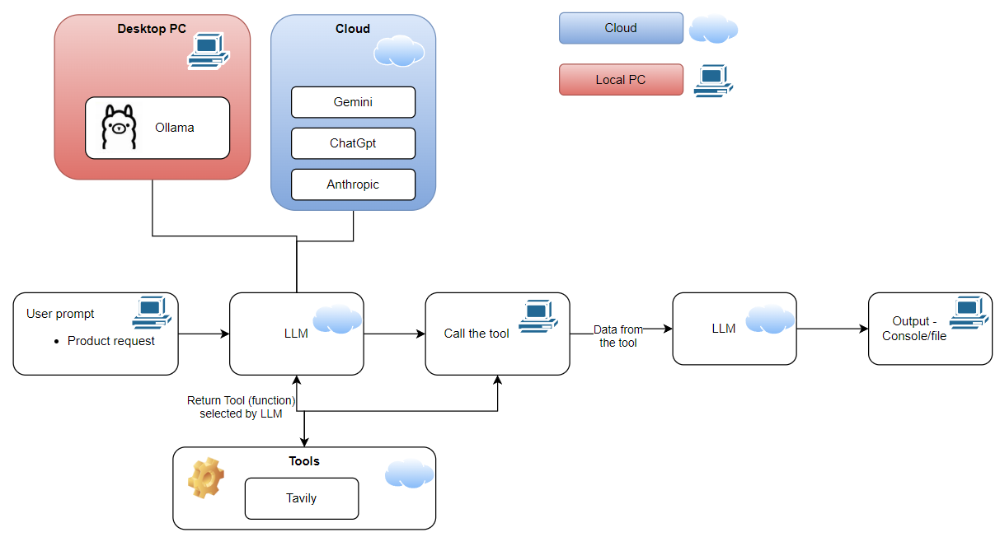
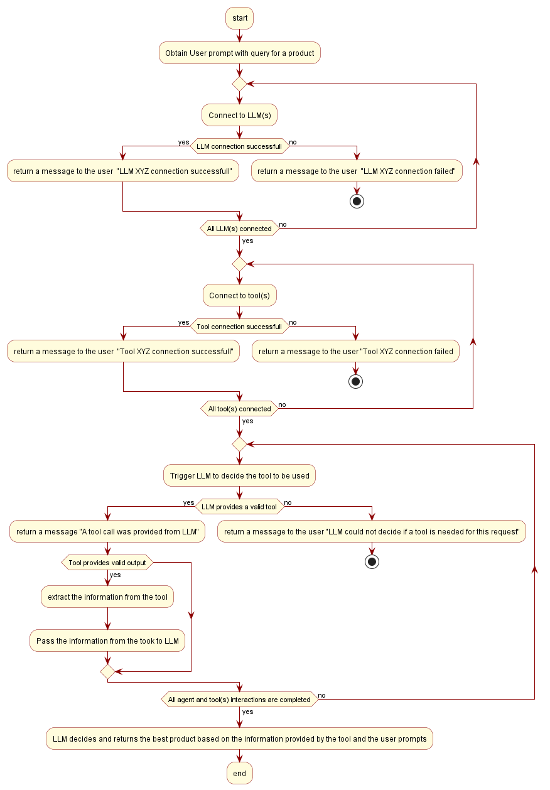

# GoogleRapidAgentHackthonJun2026
This repo is for the Google Rapid Agent Hackthon on Jun2026 in devpost. 

# Goal
Create an AI agent to access e-commerce websites to obtain infomration about different products and provide the reccomendation for the best product as defined in the user prompt.

# Usage
## Target 
- WINDOWS
- Python version 3.12 or above

## Prerequisites
- run "pip install -r requirements.txt" in the repository folder using command window to ensure all needed libraries are installed.
- Since the testing was done with ollama model Please, ensure Ollama is installed and runnning before running the file "GoogleHackathon2026Jun.py"
- Exact model used can be configured in config.py under the below section
> OLLAMA_MODEL = "qwen2.5:7b"

> GEMINI_MODEL = "gpt-4.1"

> OPEN_AI_MODEL = "gemini-2.5-flash"
### Configuring the environmental variables for API keys
- Please ensure below environmental variables are defined in your PC, as per the configurations mentioned in config.py. No need to define environment variable if only ollama model is used.
  - For the below configuration in config.py

  >ANTHROPIC_API_KEY = "dummy"

  >OPEN_AI_API_KEY = "OpenAIKey_Json55"

  >GEMINI_API_KEY = "GeminiAPIKey_Json55"

  >TAVILY_API_KEY      = "TavilyAPIKeyJson55" #Web search AI tool

      - Tavily API 
        - name : TavilyAPIKeyJson55
        - value: API key from tavily
      - If Gemini/OpenAi models are used please ensure below environmental variables are defined in your PC
        - OpenAI API 
          - name : OpenAIKey_Json55
          - value: API key from tavily
        - Gemini API 
          - name : GeminiAPIKey_Json55
          - value: API key from tavily

# Block diagram

# File Structure
- config.py
  - This file contains
    - The configuration specifying the model vendor used. Example: For using Ollama models the configutaion is "MODEL_VENDOR_USED = MODEL_VENDOR_DICT["Ollama"]"
    - List of models for different vendors which is used to decide if the model used in the main file "GoogleHackathon2026Jun.py" is allowed as per this configuration. Done to ensure that model used is intended and there are no monetory consequences.

- utils.py
  - This is the library of functions needed to
    - Abstract the functionalities of API access.
    - Internal functions to provide the list of models specified in config.py for each vendor (exception : list od ollama models are updated by the script since they are offline and free).
    - Internal function to check if the models used in the mail file "GoogleHackathon2026Jun.py" part of the list specified in config.py.
    - Functions for testing if the model is responding to basic prompts.
    - Abstract the AI agent functionality.
   
- GoogleHackathon2026Jun.py
  - This is the main file of the repository.
  - The object of this file is to specify the user prompt.
  - Define the tool schema (dictonary format) to be passed to AI agent function in utils.py
  - Call the AI agent function with the neeeded model, user prompt, and tool schema.

- toolschemaGen.py
  - Converts native tool information to model venor specific tool schema

# Activity diagram

# Known issues
## When using offline model "qwen2.5:7b"
- Not all entires in eccomerce websites are listed.
- User prompt needs to be precise. Example : Use the search tool to find the current price and discounts for a latest iphone on Amazon and Flipkart e-commerce websites and recommend the cheapest and best product.
- In some examples, when user prompt specifies any e-commerce website. The Agent only looks into amazon website.

## Online model testing
- Online models have not been tested due to monetory constraints.
- Specifically Gemini since it was required that financial infomration be first provided to use Gemini API. This could lead to surprise bills if not handled properly.
  
## Implementation
- Although some functions in utils.py are mentioned as internal functions here, they are not restricted yet using private class.
